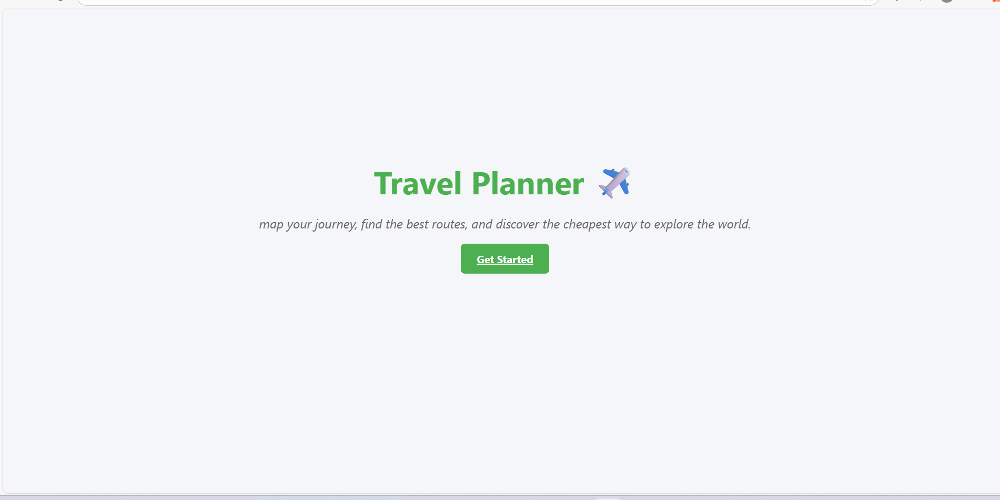
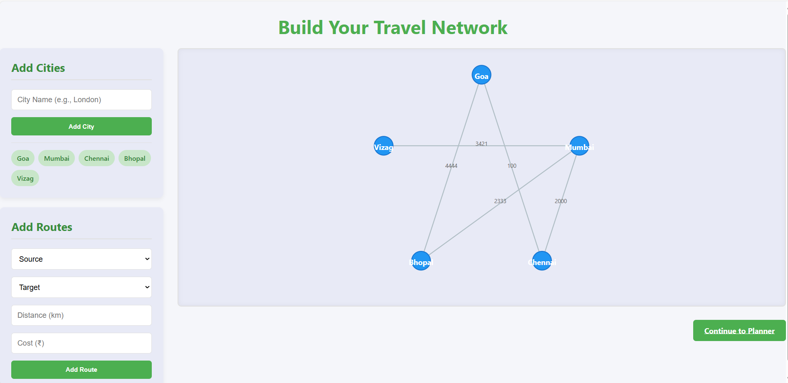
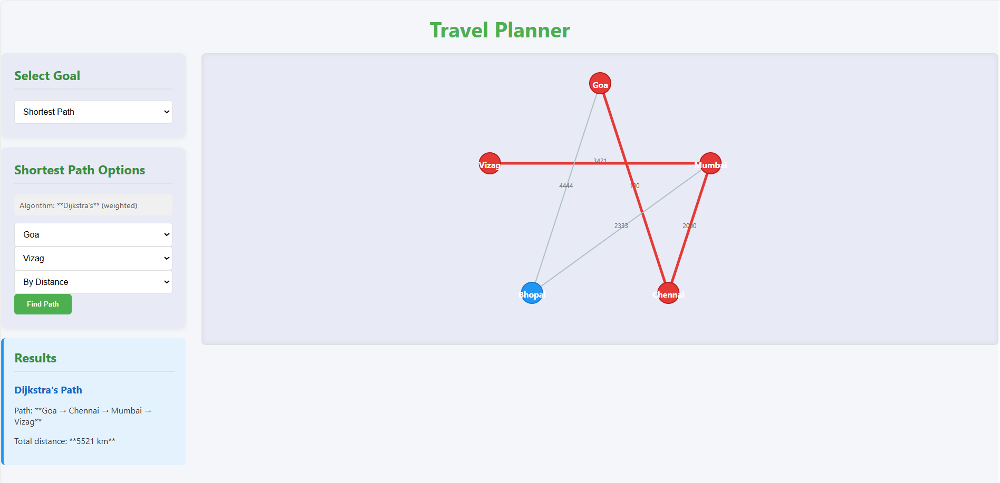

# ✈️ Travel Planner 
Travel Planner is a React-based web app where users can:
- Add and connect cities (nodes + weighted edges).
- Run graph algorithms like **Shortest Path (Dijkstra)** and **Minimum Spanning Tree (Prim/Kruskal)**.
- Visualize the algorithm execution step by step.
- Get travel plan outputs such as best route and minimum connection cost.

This project combines **Web Development (ReactJS + CSS)** with **Graph Algorithms (DSA)**.

## Features
- **Interactive Graph Builder**  
  - Click to add cities (nodes).  
  - Connect cities with routes (edges) and assign weights (distance/cost/time).  

- **Algorithm Selector**  
  - Shortest Path → *Dijkstra*  
  - Minimum Spanning Tree → *Prim / Kruskal*  

- **Visualization**  
  - Animated Dijkstra expansion.  
  - MST edges highlighted as they are added.  

- **Travel Plan Output**  
  - Best route with cost/time.  
  - Minimum cost to connect all cities. 

## Getting Started

1. Install dependencies  
   ```bash
   npm install
   ```

2. Start the development server  
   ```bash
   npm start
   ```

   The app will be running at: [http://localhost:3000](http://localhost:3000)

---

## Screenshots

### Landing Page


### GraphBuilder Page


### Planner Page 

## Demo Video

https://github.com/J-aswanth/Travel-Planner/blob/main/demo.mp4
